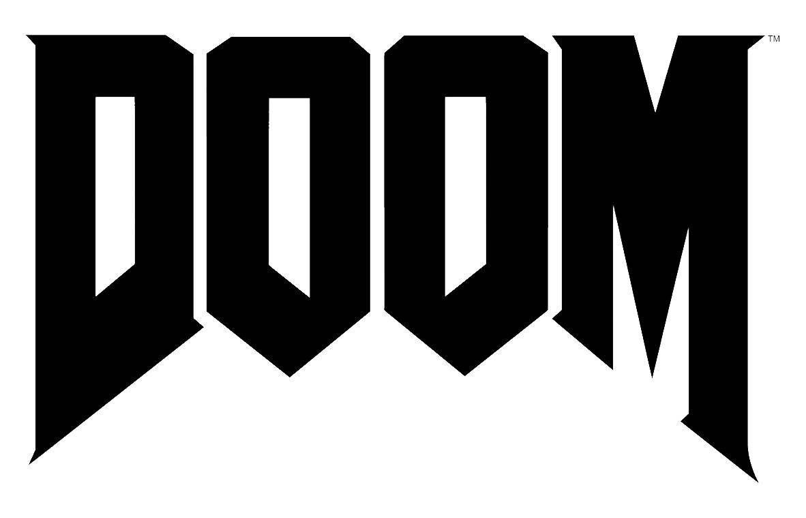

# 🔫 Salesforce: Can it run Doom?

> **"Rip and tear... your sales pipeline."**



---

## 💀 Why?

Because "can it run Doom?" is the eternal question. We've seen Salesforce run DosBox games, but now we need to know, once and for all in native code: can Salesforce run Doom?

**Yes. Yes it can.**

This project implements Doom as a Lightning Web Component (LWC) exposed on a publicly accessible Salesforce Digital Experience site — so anyone on the internet can play Doom, served by Salesforce.

---

## 🎮 What's in the box

| Component | Type | Description |
|---|---|---|
| 🕹️ `doom` LWC | Lightning Web Component | The component that will render and run Doom |
| 📑 `Doom` Tab | Custom Tab | Wires the LWC into Lightning |
| ⚡ `Doom` App | Custom Application | Lightning app with the Doom logo |
| 🖼️ `DoomLogo` | Static Resource | The iconic Doom wordmark |
| 🔐 `DoomPlayers` | Permission Set | Access to the app, tab, and LWC |

---

## 🏗️ Architecture

```
🌐 Internet
    └── 🏢 Salesforce Digital Experience Site (public, no login)
            └── ⚡ Lightning Web Component
                    └── 👾 Doom (JavaScript / WebAssembly)
                            └── 💀 Demons (getting ripped and torn)
```

---

## 🚀 Setup

### Prerequisites

- Salesforce CLI (`sf`) 🛠️
- A Salesforce Dev Hub org 🏛️
- A burning desire to rip and tear 🔥

### Install

```bash
# 🔑 Authenticate to your Dev Hub
sf org login web --set-default-dev-hub

# 🧪 Create a scratch org
sf org create scratch --definition-file config/project-scratch-def.json --alias doom

# 💥 Deploy
sf project deploy start --target-org doom
```

---

## 📦 Unlocked Package

This project is structured as an **unlocked package** for easy distribution and versioning. Install it in any org and unleash hell. 😈

```bash
# 🆕 Create the package (first time, requires Dev Hub)
sf package create --name "Doom" --type Unlocked --path doom --no-namespace

# 🔖 Create a package version
sf package version create --package Doom --installation-key-bypass --wait 10

# 📥 Install in a target org
sf package install --package <version-id> --target-org <org-alias>
```

---

## ❓ Why

```
The eternal question: "Can it run Doom?"

✅ Your grandma's toaster: yes
✅ A pregnancy test: yes
✅ A John Deere tractor: yes
✅ Salesforce: ...
```

**Nobody had asked Salesforce. Until now.**

The answer is yes. Obviously yes. It was always going to be yes.

---

## 🩸 Status

- [x] 🏗️ Salesforce app scaffolded
- [x] ⚡ LWC created
- [x] 🌐 Digital Experience site ready
- [ ] 👾 Doom engine embedded
- [ ] 💀 Demons added
- [ ] 🔫 Ripping and tearing commenced

---

## 🤘 Contributing

Found a bug? Open an issue. Want to add more demons? Open a PR. Want to question whether this was a good idea? Too late.

---

*"Thy flesh consumed, thy soul devoured... by Apex triggers."* 👹
